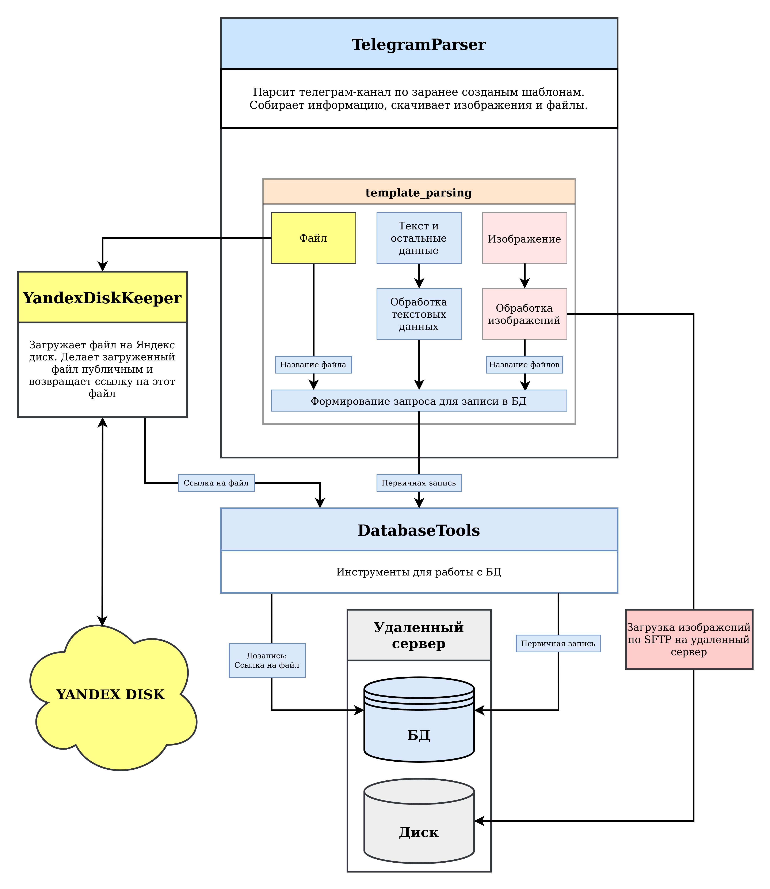
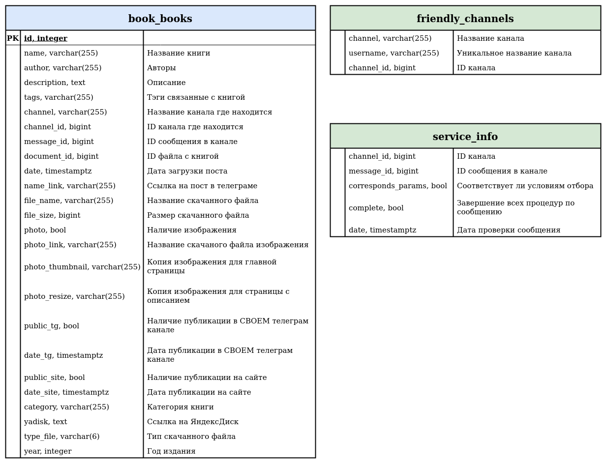
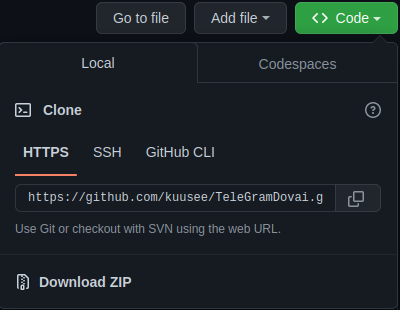
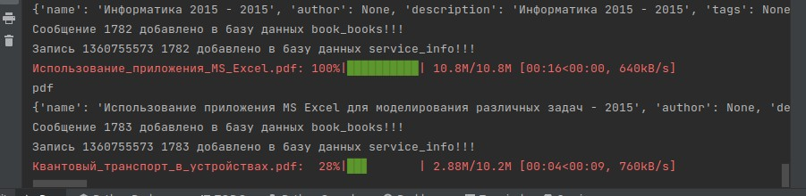

<h1 align="center">TeleGramDovai</h1>

<p align="center">
    
    
</p>

<p align="center">
    <a target="_blank" href="https://t.me/Imbestmanofplanet" title="Telegram">
        
    </a> 
</p>

<h2 align="center"></h2>

<p align="justify">
Парсер телеграм каналов с функцией скачивания файлов и изображений на локальный компьютер, сохранением текста сообщений и информации о нём в БД. Загрузкой файлов на ЯндексДиск и/или на ftp сервер.

Создавался как набор инструментов для автоматизации действий по размещнию контента для конкретного сайта, но обладает некоторой гибкостью для использования в других проектах.


<h2 align="center">Механика работы</h2>

Основная идея проекта - это использование шаблонов для каждого канала. В шаблоне описывается логика по которой сообщения отбираются, редактируются, скачиваются файлы и т.д. Такой подход обусловлен тем, что каналы как правило имеют разнородную структуру, так и в самих каналах присутствует шум в виде посторонних сообщений. В любом случае всегда можно создать универсальный шаблон.


Собственно если сообщение удовлетворяет условиям, оно проходит процесс редактирования, скачивании файлов и изображений на локальный компьютер и записью данных в БД.

После парсинга канала, файлы и изображения загружаются на удаленные хранилища и сервера (если требуется).
</p>
<p align=center><i>Схема работы:</i></p>
    <p align=center>
        
    </p>


<h2 align="center">Стек</h2>

Python, Psycopg2, Yadisk, Pysftp, Teleton, PostgreSQL 10

<h2 align="center">Структура Проекта</h2>

```

TeleGramDovai/
    ├── DatabaseTools/
    │     ├── connect.py
    │     ├── __init__.py
    │     └── schemas.py
    │
    ├── TelegramParser/
    │     ├── templates/
    │     │     └── physics_lib.py
    │     ├── __init__.py
    │     └── parser.py
    │
    ├── Utils/
    │     ├── __init__.py
    │     └── plugins.py
    │
    ├── YandexDiskKeeper/
    │     ├── __init__.py
    │     └── keeper.py
    └── run.py
```

**DatabaseTools**:

- `connect.py` - включает класс для подключения и работы с БД;

- `schemas.py` - шаблоны для создания таблиц БД;


**TelegramParser**:

- `parser.py` - включает класс для подключения и работы с Telegram(загрузка сообщений, файлов, изображений). Также включает набор функций для работы с сообщениями Telegram;

- *templates/* - папка с шаблонами для парсинга телеграм каналов;


**Utils**:

- `plugins.py` - различные функции (подключение по sftp, создание локальных директорий и т.п.);


**YandexDiskKeeper**:

- `keeper.py` - функции для работы с YandexDisk (проверка, загрузка файлов);

`run.py` - файл запуска скрипта;


<h2 align="center">Структура БД</h2>

<details>
    <summary>Структура и описание таблиц</summary>
        <p align=center>
            
        </p>
</details>


<h2 align="center">Собственные шаблоны</h2>

В директории *TelegramParser/templates/* находится пример шаблона `physics_lib.py`. Шаблон представляет собой python-файл с функцией определяющей логику поведения отбора, загрузки, и записи в БД. Соответстветствующие функции для этих задач уже написаны и находятся в *TelegramParser/parser.py*.

Для написания шаблона нужно посмотреть на структуру канала, и структуру сообщений в нём, выделить характерные особенности для них и уже писать логику отбора.

Например, в сообщение есть описание, изображение материала и ссылка на канал по которой можно скачать файл. Под такие особенности попадают как нужные сообщения, так и рекламные. Следовательно добавляем канал с нужными нам сообщениями в таблицу friendly_channels БД. Далее в шаблоне применяем функцию get_links_from_message() из *TelegramParser/parser.py* которая проверяет находится ли этот канал в БД и т.д.


<h2 align="center">Установка</h2>

1) **Установка ПО:**

    Установить Python 3.7.5 и PostgreSQL 10 любым удобным способом.


2) **Загрузка файлов проекта:**
    
    - Из терминала Linux с github:

        `$ git clone https://github.com/kuusee/PlaxisRectangleGrid.git`

    - Скачать и распаковать:

        <p align=center>
            
        </p>

3) **Настройки проекта:**

    Устанавить требуемые библиотеки из файла `requirements.txt` в корневом каталоге.

    В корневом каталоге также переименовать файл `.env.dist` в `.env` и ввести свои данные в соответствующие переменные. 

    Как получить некоторые данные:

    - **Обязательно** для работы с Telegram необходимо получить [telegram_api_id и telegram_api_hash](https://tlgrm.ru/docs/api/obtaining_api_id);

    - Для работы с ЯндексДиск необходимо получить [токен ЯндексДиска](https://yandex.ru/dev/direct/doc/start/token.html). Соответственно ЯндексДиск является необязательным, можно использовать и локальный диск(т.е. можно не заполнять);

    - При подключении к БД с использованием сертификата необходимо указать путь до него в переменной PATH_DATABASE_CERT;

    В файле `run.py` редактируем переменые:
    ```
    Переменные путей:
    PATH_DOWNLOAD, PATH_PHOTO, PATH_REMOTE_PHOTO, YADISK_DOWNLOAD,

    Переменные характеристик файлов:
    LIMIT_FILE_SIZE, TYPE_FILE_DOWNLOAD,

    Паттерны поиска изображений:
    NAME_FILE_PHOTO_PATTERN, 

    Название таблиц в БД:
    MAIN_TABLE, SERVICE_TABLE, FRIENDLY_CHANNELS_TABLE.
    ```

    В файле `run.py` нужно закомментировать строчки связанные с ЯндексДиск и sftp если их использование не требуется.

    При использовании своих шаблонов для каналов их нужно прописать в `run.py`.

4) **Запуск проекта:**
    
    Запустите файл `run.py`.

    При каждом запуске происходит проверка наличия таблиц БД и путей для файлов. В случае их отсутствия они создаются автоматический.

    Сообщения по операциям выводятся в терминал:

    <p align=center>
        
    </p>
